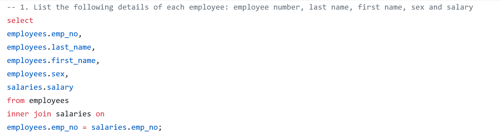
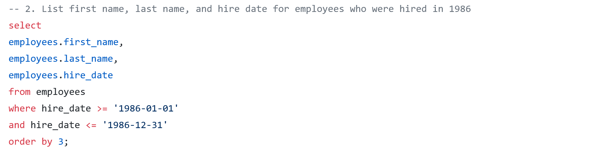
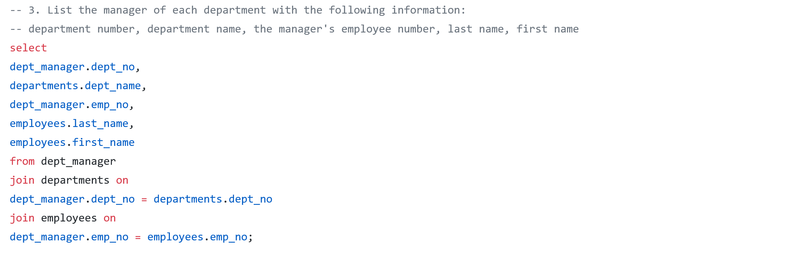

# sql-employee-database

## Background

In this exercise I have been hired as a new data engineer at Pewlett Hackard. My first major task is a research project on employees of the corporation from the 1980s and 1990s. All that remain of the database of employees from that period  are six CSV files.

In this assignment, I will design tables to hold data from the CSVs, import the CSVs into a SQL database, and answer questions about  the data. 

I sketched out an ERD of the tables using http://www.quickdatabasediagrams.com.

For the Data Analysis portion I conducted the following analysis:

1. List the following details of each employee: employee number, last name, first name, sex, and salary.

   

2. List first name, last name, and hire date for employees who were hired in 1986.

   

3. List the manager of each department with the following information:  department number, department name, the manager's employee number, last  name, first name.

   

4. List the department of each employee with the following information:  employee number, last name, first name, and department name.

5. List first name, last name, and sex for employees whose first name is "Hercules" and last names begin with "B."

6. List all employees in the Sales department, including their employee number, last name, first name, and department name.

7. List all employees in the Sales and Development departments,  including their employee number, last name, first name, and department  name.

8. In descending order, list the frequency count of employee last names, i.e., how many employees share each last name.